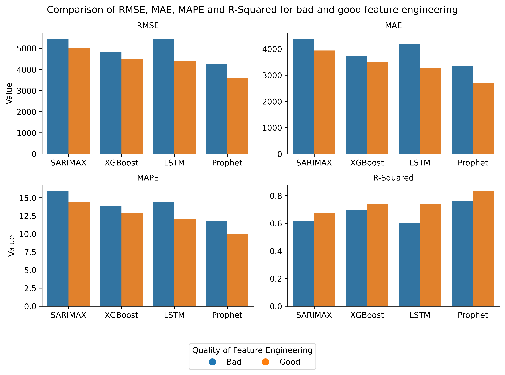
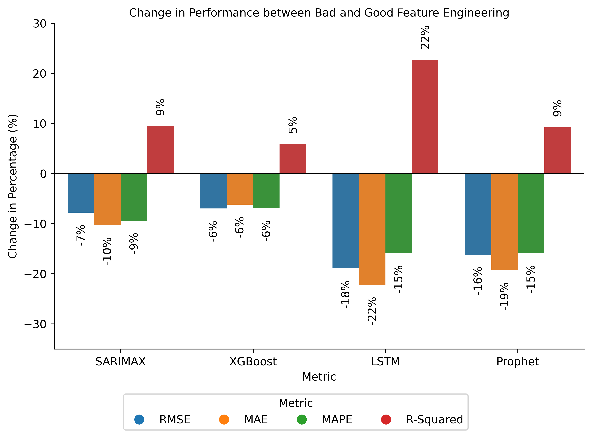
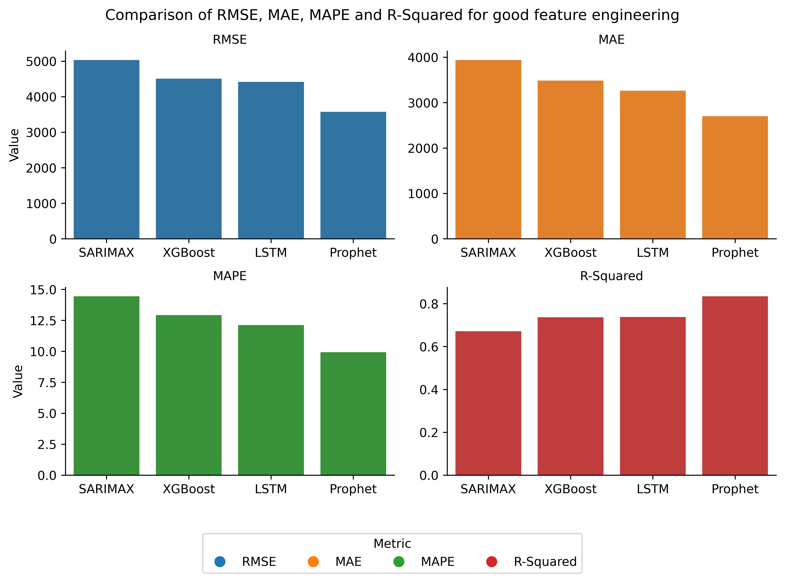
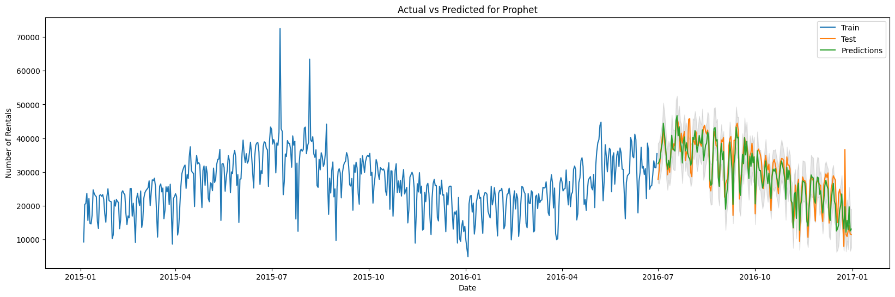

# London Bike Sharing Prediction Model

## Goal
The goal of this project is to predict the number of bikes that will be rented in a given day in London. While preparing the model, this project also aims to distinguish the impact of good and bad feature engineering on the model's performance. Four different models are trained and tested in this project. The models are: 
1. SARIMAX
2. XGBoost
3. LSTM
4. Prophet

## Description
The dataset used in this project is the [London Bike Sharing Dataset](https://www.kaggle.com/datasets/hmavrodiev/london-bike-sharing-dataset) from Kaggle. The dataset contains the following  columns:
- "timestamp" - timestamp field for grouping the data
- "cnt" - the count of a new bike shares
- "t1" - real temperature in C
- "t2" - temperature in C "feels like"
- "hum" - humidity in percentage
- "wind_speed" - wind speed in km/h
- "weather_code" - category of the weather
- "is_holiday" - boolean field
- "is_weekend" - boolean field
- "season" - category field meteorological seasons
- "weathe_code" - category field for weather situation

## Feature Engineering
### Bad Feature Engineering
As an example of bad feature engineering, we will take the median of temperature, humidity, and wind speed for each day. For weather code and season, we will take the most frequent value. For holiday and weekend, we will take the maximum value since all the values will be same for each day. This way of feature engineering is not good because we are losing a lot of information with respect to time of day. For example, if it rains from 12 am to 8 am and then from 6 pm to 12 am, entire day is marked as rainy. Since most of the travel happens during the day, this is not a good representation of the data. 

### Good Feature Engineering
As an example of good feature engineering, we will first divide the day into 6 time of day categories: night, dawn, morning, afternoon, dusk, and evening. Then we will calculate the average temperature, humidity, and wind speed for each time of day category. For weather code, we will use the most frequent weather code for each time of day category. This provides a more detailed view of the data for the model to learn from. 

## Results
### Comparision of impact of good and bad feature engineering on the models

- Good feature engineering has imporoved the performance of all models.The highest impact of good feature engineering is on the LSTM model followed by Prophet. The RMSE, MAE, MAPE and R-squared score have improved significantly.

### Evaluation of models trained with good feature engineering

- The best model is Prophet. It has the lowest RMSE, MAE, MAPE and the highest R2 score. The following plot shows that the actual and predicted values are very close to each other for Prophet.

## Conclusion
- Good feature engineering is very important for the performance of the model. It is important to provide the model with as much information as possible.
- Prophet is the best model for this dataset. It has the lowest RMSE, MAE, MAPE and the highest R2 score.

## Future Work
- The model can be further improved by adding more features like price of fuel, cost of public transport like bus, train, etc.
